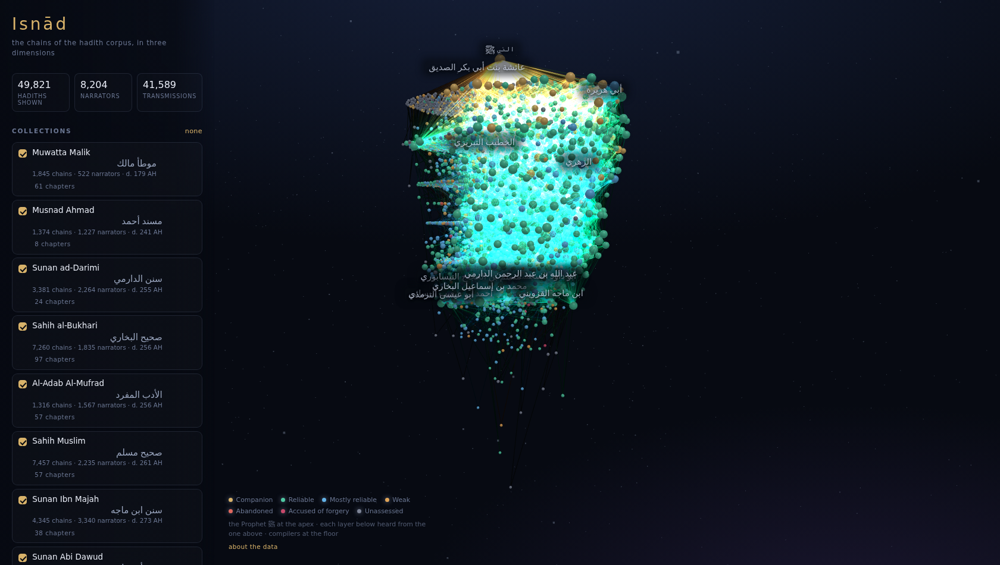
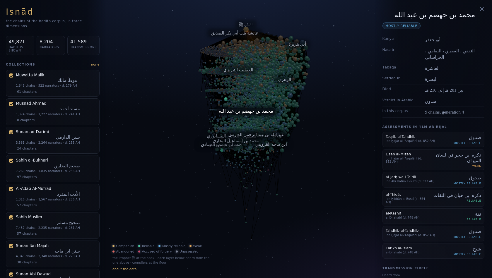
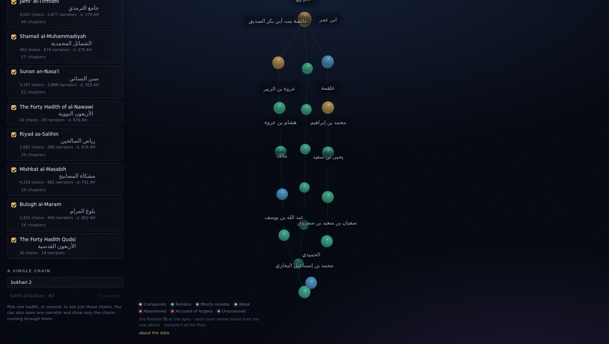
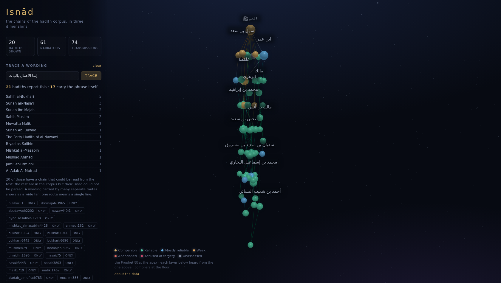

# Isnād — a 3D atlas of the hadith corpus

Every hadith carries an **isnad**: the chain of people who passed the report down,
from the Prophet ﷺ to the scholar who wrote it in a book. This project reads those
chains out of the Arabic text of the collections, matches each name against the
biographical literature of **ʿilm ar-rijāl**, and draws the whole corpus as one
graph in three dimensions.

The Prophet ﷺ sits at the apex. Each layer below is a generation of transmitters
who heard from the layer above, and a line is drawn only where the isnad says one
belongs: a report that never names him is not joined to him, and a step the chain
does not attest is dashed rather than solid. The compilers — al-Bukhārī, Muslim,
Mālik — are at the floor. Click any narrator to read their biography, the verdicts classical
critics passed on them, who they heard from and taught, and the chains they carry.
The node at the apex opens the sīra in outline instead — lineage, family, the
hijra, the campaigns — since a grade, a generation and a list of chains would all
be the same answer for him.

You can look at one hadith, a chapter, several collections, or everything at once —
or search the text and see every chain that carries a given wording.



| One narrator | Three chains |
| --- | --- |
|  |  |

## Tracing a wording

Search a phrase, in Arabic or English, and every hadith reporting it goes into the
graph together. The count answers how many times the corpus records the statement
being transmitted; the shape answers how independent those routes were.



`إنما الأعمال بالنيات` comes back as **21 reports across twelve collections** — five
of them in al-Bukhari alone — and the picture shows why the hadith is called *gharīb*
at its root: a single strand from ʿUmar down through four narrators before it fans
out to every compiler.

Matching is deliberately loose. A hadith qualifies on most of the query's words
rather than all of them, because the same statement is transmitted with a word
changed (`بالنية` for `بالنيات`, one translator's phrasing for another's), and
demanding every term would hide exactly the corroborations the question is about.
Adjacent word pairs are indexed too, which is what floats the exact wording to the
top, and lets the results be narrowed to the reports carrying the phrase itself
rather than the words scattered through them — of the 21 hadiths matching those
words, 17 carry them together.

The layout is built for a phone as well as a desktop: the panel becomes a sheet
that opens from the top bar, so the graph is never fighting it for the screen.

## Isolating a narrator

Right-click a narrator — long-press on a phone — for **only the chains through
this narrator**. The graph is rebuilt from the hadiths whose chain actually runs
through them, which is the only way to read a busy transmitter: at corpus scale
ʿĀʾisha is a bright knot with three thousand lines through it, and no amount of
rotating separates the chains that are hers from the ones passing nearby.

It stacks. Isolate on a second narrator and only the chains carrying *both*
survive, which answers a question the whole graph cannot: whether these two ever
stood on the same isnad. ʿAbd al-Raḥmān b. Samura and Muʿādh b. Jabal, on 32 and
several hundred chains respectively, share exactly one.

Isolation is a lens over whatever is already selected rather than a selection of
its own, so it composes with the collections and the search: *these chains, for
this wording, in these two books, through this man.*

The view survives a refresh. What is stored is the question — the query, the
book slugs, the narrators being isolated on — never the hadiths it matched, so
a saved view stays valid when a collection is re-ingested and the ids move.

## Finding one narrator

Type a name into **Find a narrator** and the transmitter lights up in the graph
with everything they did not carry dimmed behind them — the view the whole
picture is hardest to give you, reached from the one thing you already know.

It searches the whole register rather than what is drawn, because being told a
man is in the corpus but not in the collections you have open is an answer and
an empty list is not; results say which they are.

Only 84 of the 8,123 narrators carry an English name — the compilers, and a few
famous kunyas — so a Latin query has to reach the Arabic itself. It does it
through the consonants: `abu hurayra`, `أبو هريرة` and `Abū Hurayrah` all reduce
to `bhr`, since vowels are the one thing no two transliterations agree on. What
that costs is precision, so weight decides between the hits — `bhr` is *exactly*
Abū Baḥr of seven chains and merely the start of Abū Hurayra of 5,944, and it
means Abū Hurayra.

## What the lines claim

A line between two narrators is a claim that one heard it from the other, so the
graph draws one only where the isnad makes it.

**A report that stops, stops.** The line to the apex is drawn where the chain
runs into the Prophet ﷺ — 74.5% of the corpus. Where it does not but the report
names him anyway, the step is drawn **dashed**: the report is his and only this
reading of the isnad fell short (11.4%). Where he is not named at all, **no line
is drawn to him** (14.0%). That last case is what mawqūf and maqṭūʿ *are* — the
report stops at a Companion or a Follower — and the Muwaṭṭaʾ, half of which is
āthār, shows it most: 966 of its 1,847 chains stand clear of the apex.

**A narrator nobody could name is a jump, not a hearing.** Isnads routinely name
someone only by relation — `عن أبيه`, `عن أخيه`, `عن مولاه` — and where no table
turns that into a man the chain is one narrator longer than it looks. Those steps
are recorded at ingest (3,204 of them, on 6.3% of chains) and drawn dashed, so the
two ends are joined without claiming they met.

A pair is only ever drawn dashed when *no* chain in the corpus attests it
directly. One isnad naming the man in full is enough to make the link solid
everywhere, because the graph is the union of what the corpus says, not of what
any one reading of it missed.

## Kinds of report

The sidebar can narrow the corpus to kinds of hadith, from three groups that are
not equally certain and are kept apart for that reason. The panel is folded
until asked for — ten options with their classical terms is most of a phone
screen — and names whatever it is holding while closed, so a filter can never be
left on out of sight.

**Al-Albānī's ruling** — sound, good, weak, denounced, fabricated — for the
third of the corpus he ruled on. **The shape of the chain** — a senior narrating
from a junior (*riwāyat al-akābir ʿan al-aṣāghir*), transmission between
contemporaries (*riwāyat al-aqrān*), a short chain (*isnād ʿālī*), a chain not
traced to the Prophet — read straight off the chain, so these are exact: they
restate what the graph already draws.

**Who is in the chain** — at present, whether a woman transmitted it. No profile
in the rijāl database records a sex, so this is read off how the literature names
people: `بنت`, an `أم` kunya, or ṣaḥābiyya said outright. The one trap is a man
named through his mother — Yaʿlā ibn Umayya is also `يعلى بن منية بنت غزوان` — so
the rule is not *does the name contain bint* but *does bint come before bin*,
whichever names this person rather than a parent. That finds **209 women, on
4,899 chains**; a woman named by neither marker would be missed, and the panel
says so.

Choices under one heading widen the result, choices under different headings
narrow it, and every option carries the count it would give against whatever
else is already chosen.

**Marfūʿ, mawqūf and maqṭūʿ are deliberately not offered.** They look derivable
from whether the chain reached the Prophet and which generation it stopped at,
and they are not. Measured against the cases where al-Albānī names the category
himself, that derivation agreed 31 times in 96 — and on mawqūf, 3 times in 21.
The parser can tell that the Prophet is *mentioned*; it cannot tell that the
report is *attributed* to him, which is the whole distinction. A filter that
wrong about a question that precise would be worse than none.

---

## Running it

```bash
npm install
npm run rijal:fetch          # ~124 MB of narrator profiles, fetched once into .cache/
npm run ingest -- --all      # or: npm run ingest -- bukhari muslim
npm run dev
```

`npm run build` produces a fully static site in `dist/` — no server, no API keys.

### Deploying

The generated corpus is committed, so a deploy is just `npm ci && npm run build`
— CI never needs the 124 MB rijal database or the upstream collections. The build
uses relative asset paths, so it works from a domain root or a project subpath
without configuration.

**Cloudflare Pages** is the recommended host. Connect the repository, set the build
command to `npm run build` and the output directory to `dist`. It is the only free
tier without a monthly bandwidth cap, it serves Brotli, and it deploys private
repositories.

To publish without giving any third party access to the repository, upload the
build directly instead:

```bash
npm run build
npx wrangler pages deploy dist
```

**GitHub Pages** is free only for public repositories — a private repository needs
a paid plan. Enable *Settings → Pages → Source: GitHub Actions* and the included
`Deploy` workflow publishes on every push to `main`.

### Tests

```bash
npm run build && npm test          # both projects
npm run test:desktop               # just the desktop one
npx playwright test --headed -g 'phrase'
```

The suite drives the built site in a real browser, because that is where this
project's failures live: a chain graph paired with the wrong layout, an Arabic
tokeniser splitting on diacritics, a panel that covers the button beneath it.
None of those are visible to a unit test of the functions involved.

| | |
| --- | --- |
| `loads.spec.ts` | the corpus fetches and draws; the canvas has a live GL context; the page has headings, names on every control, a tab order that reaches them, and text that clears WCAG AA against whatever is behind it |
| `controls.spec.ts` | every button and link — collections, chapters, pins, the reader, the biography, the narrator search, the filters, the legend — and a check that nothing on screen is covering anything else |
| `search.spec.ts` | Arabic and English queries, the phrase-only scope, clearing, a query that matches nothing, paging, and composing with the collection filter |
| `view.spec.ts` | the narrator menu, isolating and stacking narrators, and what survives a refresh |
| `mobile.spec.ts` | the sheet, the long press, and the isolation bar's geometry on a 390px screen |

Most tests start from a saved view holding one small collection, so the graph
settles in a second rather than relaxing 49,843 chains; `loads.spec.ts` is the
one that pays for the whole corpus. Timeouts are deliberately loose — CI has no
GPU, WebGL falls back to software, and a tight limit fails on machine speed
rather than on anything being wrong.

### Contributing

`main` takes changes through pull requests only. `Checks` runs on every pull
request — typecheck, build, a validation that the committed corpus still matches
its manifest, and the browser suite above. Both jobs are status checks `main`
requires, so nothing merges on a red test.

The rule that enforces this is kept in the repository as
[`.github/rulesets/main.json`](.github/rulesets/main.json), so it can be read and
reviewed rather than living only in the settings UI. To apply it: *Settings →
Rules → Rulesets → New ruleset → Import a ruleset*.

Merging is restricted as well as opening: `main` cannot be updated by anyone
outside the bypass list, so an approved pull request is still merged by a
repository admin rather than by whoever wrote it. Anything automated that needs
to write to `main` would have to be added to that list.

Regenerating `public/data` produces a very large diff by design: the corpus is
committed so that the site needs no build-time access to the sources. Say in the
pull request which books were re-ingested and what the counts came out as.

What the site actually costs to serve:

| | gzipped |
| --- | --- |
| First load — app, narrator registry, all 16 book indexes | 1.6 MB |
| A search query (fetches 2–3 index shards) | ~440 KB |
| Opening a narrator's biography | ~105 KB |
| Reading a hadith's text | ~150 KB |
| Every byte, if one visitor fetched the whole corpus | 27 MB |

245 files, 110 MB on disk, largest single file under 1 MB — inside the limits of
every major free static host, including Cloudflare's 20,000-file cap and GitHub's
1 GB site limit.

| Host | Free with a private repo | Bandwidth |
| --- | --- | --- |
| Cloudflare Pages | yes | unmetered |
| Netlify | yes | 100 GB/month |
| Vercel | yes, but the free tier forbids commercial use | 100 GB/month |
| GitHub Pages | no — public repositories only | 100 GB/month (soft) |

At roughly 2–3 MB per session, 100 GB is on the order of 35,000 visits a month.

### The catalogue

```bash
npm run ingest -- --list
```

```
  ● bukhari                Sahih al-Bukhari                  7261/7277 chains
  ○ tirmidhi               Jami` at-Tirmidhi
  …
```

Sixteen collections are wired up, including the nine canonical books. Ingest them
one at a time; each writes its own directory and the narrator registry is rebuilt
across whatever is present. Adding Muslim never re-parses Bukhari.

---

## How a chain gets built

**1 — Parse.** `tools/ingest/isnad/parse.ts` walks the transmission verbs that
open every hadith (`حدثنا`, `أخبرني`, `سمعت`, `عن`, …), taking the span after each
one as a narrator and stopping when the chain reaches the Prophet ﷺ or when a span
stops reading like a name. Kin references (`عن أبيه`, `عن جده`) are resolved
through lookup tables; where they cannot be, the link is dropped rather than
guessed at — and *recorded*, so the graph can draw the jump instead of pretending
to a hearing. This recovers a chain from **99.8%** of Sahih al-Bukhari and
**100%** of Sahih Muslim.

Word boundaries there are drawn around Arabic *letters*, not the Arabic block —
the block also holds the script's own punctuation. The scraped editions print a
comma in places no editor put one, both between a word and the word it governs
(`عَنِ ابْنِ، شِهَابٍ`) and welded to a verb (`أَخْبَرَنِي وَقَالَ، الآخَرَانِ`).
Treated as part of a word, the first hides Ibn Shihāb behind a narrator called
`ابن` and the second puts `وقال` in a chain as though it were a man.

**2 — Identify.** `tools/ingest/rijal/db.ts` matches each name against 115,735
narrator profiles and their 213,412 recorded name variants. This is the hard part:
isnads name people the way specialists would — `سفيان`, `الزهري`, `ابن شهاب` — and
hundreds of profiles can share a surface form. Chains are therefore resolved whole:
unambiguous links are fixed first, then the biographical teacher/student records,
the ṭabaqa ordering, and death dates decide the rest. A chain that reaches the
Prophet must end in a Companion, which alone rules out most namesakes.

**3 — Place.** `tools/ingest/generations.ts` settles every narrator's
generation once, for the whole corpus, from four sources in order of what can
be trusted for a given man: his own chains where there are enough of them, Ibn
Ḥajar's ṭabaqa where they are thin, and the generations of the people either
side of him where there is neither. The ṭabaqāt are calibrated against the
chains rather than assumed — the twelve of the Taqrīb track chain depth
closely — and act as a *floor*, since an elided link can only ever make a
narrator look earlier than he was.

The fourth source is when he died, and it overrules the other three where it
flatly contradicts them. Chain depth is elapsed time only while each link is a
man who heard the report from the man before him, and a compiler working out of
earlier books breaks that: he cites the Companion and stops, so the chain reads
two links deep for someone six centuries later. al-Nawawī (d. 676) came out of
Riyāḍ al-Ṣāliḥīn standing among the Successors, Ibn Ḥajar (d. 852) out of
Bulūgh al-Marām beside him, and the ṭabaqāt cannot correct it — the Taqrīb runs
out around 250 AH, and everyone it fails to reach is exactly everyone this
affects. So each generation is given a calendar landmark, learned the same way
the ṭabaqa mapping is: the death years of the narrators its own chains placed.
This corpus has them closing at 85, 140, 182, 247, 265 and 268 AH, about 42
years apart, and a man who outlives his generation's landmark by a whole
generation's span is moved down to the earliest one that can hold him — 84 of
8,123, never in the other direction, since a death year is evidence someone
lived on and never that he came early. Those past every landmark land in one
band below the last generation, labelled *later than the chains reach* rather
than numbered: the axis is depth of transmission, and a compiler who took a
report from a book has no measured depth at all. That is why his chain is
short.

Each narrator records which of the four placed him. Within a generation they
are ranked by death year, so the seniors sit above the juniors.

### Rulings on the hadiths themselves

Separate from the narrator grades, and worth not confusing with them: those
judge a *transmitter*, these judge a *report*. Four collections carry
al-Albānī's rulings — **17,893 hadiths** across the four Sunan, roughly nine in
ten of each — and the reader shows the verdict with his name on it. A grade is
never displayed without one, because ḍaʿīf as a named critic's judgement and
ḍaʿīf as an anonymous label are not the same claim.

Ṣaḥīḥ al-Bukhārī and Ṣaḥīḥ Muslim are deliberately left ungraded here. Every
hadith in them comes back "Sahih", which restates the collection's own criterion
rather than recording a verdict anyone passed, and setting it beside al-Albānī's
rulings would suggest a judgement that was never made.

There is no shared identifier to join the rulings to the text: the grade source
numbers each chapter from one, the text source numbers hadiths globally across
every collection. The two are therefore paired by position within a chapter and
then **checked against the Arabic before being believed** — a chapter whose
lengths disagree, or whose text does not line up, is dropped whole rather than
half-trusted. One chapter of al-Tirmidhī is dropped for exactly that reason.

**4 — Index.** `tools/ingest/search.ts` builds an inverted index over the text —
single words, plus the adjacent pairs that recur — sharded so a query fetches a
small slice rather than the whole thing. Arabic is folded first: vowel marks off,
alef and ya and ta-marbuta normalised, the article and fused conjunctions stripped.

**5 — Draw.** The vertical axis is that generation. Horizontal position is relaxed in a worker:
nodes are pulled toward the people they transmit with and pushed off their
neighbours. Node colour is the transmitter's grade in the rijal literature.

### On accuracy

Parsing prose is inexact, and this is a heuristic over unstructured text rather
than a scholarly edition. Two things follow, and the app is built to show both:

- Where a name could refer to more than one figure and nothing in the chain
  separates them, the identification is marked **uncertain** in the panel instead
  of being presented as settled.
- Every node keeps the raw surface forms it was read from, listed under *named in
  the chains as*, so a reading can always be checked against the text.

Names that match nothing in the rijal literature are kept as nodes in their own
right, greyed and marked as unassessed, rather than being dropped or invented.

**This is a research and visualisation tool. It is not a source for legal rulings,
and a grade shown here is a database lookup, not a considered judgement on a
hadith's authenticity.**

---

## Layout

```
src/
  corpus/        the on-disk schema and a lazy loader for it
  search/        the tokeniser (shared with the builder) and the query engine
  graph/         selection → graph, and the layout worker
  scene/         three.js rendering: instanced nodes, additive edges, glow
  state/         the store, and what of it survives a refresh
  ui/            selection sidebar, narrator search, biography panel, reader, menu
tests/           browser tests, run against the built site
tools/ingest/
  books.ts       the catalogue — add a collection here
  isnad/         Arabic normalisation and the chain parser
  rijal/         the narrator database and the name resolver
  generations.ts placing every narrator in a generation
  search.ts      the full-text index
  cli.ts         fetch → parse → identify → write
public/data/     generated corpus (committed, so the site is deployable as-is)
```

### Adding a collection

Add an entry to `BOOKS` in `tools/ingest/books.ts`:

```ts
{
  slug: 'tirmidhi',
  titleEn: "Jami` at-Tirmidhi",
  titleAr: 'جامع الترمذي',
  authorEn: 'Abū ʿĪsā al-Tirmidhī',
  authorAr: 'أبو عيسى الترمذي',
  authorDiedAH: 279,
  path: 'db/by_book/the_9_books/tirmidhi.json',
  gradesFrom: 'tirmidhi',        // optional per-hadith authenticity gradings
}
```

Then `npm run ingest -- tirmidhi`. Nothing else in the pipeline or the app is
book-specific. A collection from a different source needs only a function that
yields `{ idInBook, chapterId, arabic, english }` — the parser and resolver take
it from there.

---

## Data sources

This project does not digitise texts; it builds on open datasets and is grateful
to them.

| Source | Used for | Licence |
| --- | --- | --- |
| [hadith-json](https://github.com/AhmedBaset/hadith-json) (pinned at `v1.2.0`) | Arabic text and English translation of the collections, scraped from [sunnah.com](https://sunnah.com) | Hadith texts, public domain collections |
| [Itqan](https://github.com/R3GENESI5/Itqan) by Ali Bin Shahid | 115,735 narrator profiles consolidated from 22 classical works of ʿilm ar-rijāl; al-Albānī's per-hadith rulings on the four Sunan; the kinship and kunya lookup tables | Code MIT; data compiled from public-domain classical sources |

Where a narrator could be matched to his entry in **Taqrīb al-Tahdhīb** with
confidence — 5,446 of them — the assessment opens onto what Ibn Ḥajar actually
wrote, in Arabic, with the edition named beneath it. A card that cannot open
says which of the two reasons it is: the work has not been read in full yet, or
it was read and he could not be identified in it. The text is read from
[OpenITI](https://github.com/OpenITI), the entries are matched by name rather
than through Itqan's own `entry_id` (which is approximate: a fifth of its Taqrīb
citations land on a different man), and a match that cannot be made uniquely is
not made at all. `docs/rijal-entry-texts.md` sets out the rule and the numbers.

The verdicts shown in the biography panel come from the classical literature via
Itqan — Ibn Ḥajar's *Taqrīb al-Tahdhīb* and *Tahdhīb al-Tahdhīb*, al-Mizzī's
*Tahdhīb al-Kamāl*, Ibn Abī Ḥātim's *al-Jarḥ wa-l-Taʿdīl*, Ibn Ḥibbān's
*al-Thiqāt*, al-Dhahabī's *Mīzān al-Iʿtidāl*, *al-Kāshif* and *Siyar Aʿlām
al-Nubalāʾ*, Ibn Saʿd's *Ṭabaqāt*, Ibn ʿAdī's *al-Kāmil*, and others. Each is
attributed to its work and author where shown.

One thing in the app is not derived from the corpus: the sīra outline shown when
the Prophet ﷺ is opened, in `src/ui/sira.ts`. It is written from the standard sīra
— Ibn Isḥāq in Ibn Hishām's recension, Ibn Saʿd's *Ṭabaqāt*, al-Ṭabarī — and says
so on the panel itself. Where those sources differ, it says that rather than
picking.

The isnad parser's approach, and the kinship and kunya tables it uses, follow
Itqan's `parse_isnad_chains.py`; the parser here is a separate implementation in
TypeScript that produces a chain per hadith rather than an aggregate per book.

`.cache/` holds the downloaded sources and is not committed. `public/data/` holds
the generated corpus and is.
